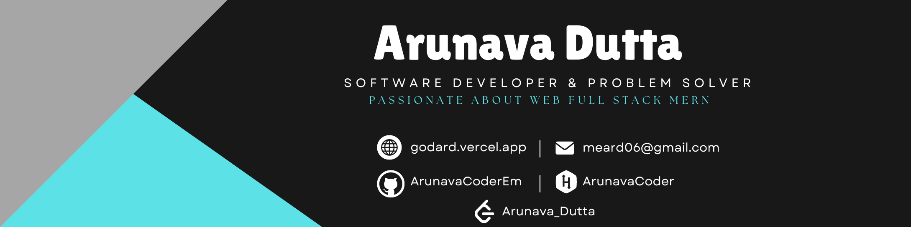

<h1 align="center" text="red" >Hola !  , I'm Arunava Dutta</h1>
<h3 align="center">Software Developer From India - Always A Learner.</h3>

---

## 📚📚 About Me:
<h6 align="right" margin="50">Solutions are crafted, and logic is built.</h6>
<image align="right" padd  src="https://i.giphy.com/media/v1.Y2lkPTc5MGI3NjExZDNkY2Q4MDlrNWgybnJyYjExNnB4NjJvNnUyZGd5ZW96OGFrdTFtayZlcD12MV9pbnRlcm5hbF9naWZfYnlfaWQmY3Q9Zw/qgQUggAC3Pfv687qPC/giphy.gif"  width="35%" alt="code">
  <ul style="display:flex;">
    <li>🔭 I’m currently working on - {My Own Voice Assistant For PC 'Alfred' ⭐}</li>
    <li>👯 I’m looking to collaborate on - {Web Projects ⭐}</li>
    <li>🤝 I’m looking for help with - {Back-end Development ⭐}</li>
    <li>🌱 I’m currently learning - {Websocket, Flutter, WebRTC, Linux Shell ⭐}</li>
    <li>💬 Ask me about - {Software Development, Problem Solving & Much More ... ⭐}</li>
    <li>⚡ Fun fact - {Funny Guitarist With A Screen In Front ⭐}

    <li>🫠 Visit Me Here - <a href="https://meard.vercel.app/" target="_blank">{Godard 🫠}</a></li> 
</ul>

---

## 🌐 Socials:
       

---

## 🖥️ My Workstation
- **Processor:** Intel Core i5-10300H
- **RAM:** 16GB
- **Graphics Card:** GeForce GTX 1650 Ti 4GB
- **Operating System:** Windows 11 Home 64bit
  
---

## 💻 Tech Stack:

### Coding Language stack

    
    
    
    
    

### Frontend stack

    
    
    
   
        
    

### Backend stack

    
    
    
    
    
    

### Libraries stack

    
     
     
    

### Database stack

    
        

### Editing stack

    
    
    
    

### Deployment stack

    
    
    

---

## 📊 GitHub Stats:

  

  

  

  

---

## 🧑🏽‍💻 My Leetcode:

---

## ✒️ Random Dev Quote

  

---
  
## 🏆 GitHub Trophies

  

---

  

